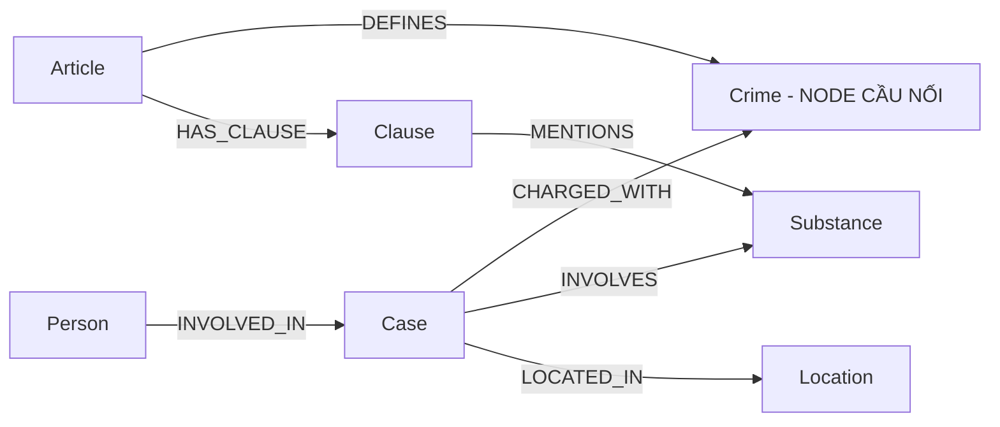

# Thiết kế Ontology — Day 19

**Họ tên:** Nguyễn Lê Phước Tiến  
**MSSV:** 2A202602616

**Lựa chọn** (đánh dấu một):
- [x] Dùng ontology gợi ý (có thể chỉnh nhỏ)
- [ ] Tự thiết kế (xét bonus +15, xem `SUBMISSION.md`)

## 1. Sơ đồ



`Crime` là node cầu nối chính giữa KB tin tức và KB luật.

Đường đi xuyên hai KB tiêu biểu:

```text
Person
  -> INVOLVED_IN
Case
  -> CHARGED_WITH
Crime
  <- DEFINES
Article
  -> HAS_CLAUSE
Clause
```

Ngoài ra `Substance` hỗ trợ nối thông tin về loại và khối lượng ma túy của vụ án với các khoản luật có nhắc tới chất tương ứng.

## 2. Entity types (node labels)

| Label | Ý nghĩa | Khóa định danh (`MERGE` theo) | Properties | Lấy từ KB nào | Trích bằng |
| --- | --- | --- | --- | --- | --- |
| `Article` | Điều luật | `id` | `id`, `title`, `law`, `doc_id` | Luật | Regex/parser |
| `Clause` | Khoản thuộc một Điều luật | `id` | `id`, `number`, `penalty`, `text`, `doc_id` | Luật | Regex/parser |
| `Crime` | Tội danh | `name` | `name`, `doc_id` | Luật + tin tức | Parser + `link_entity` |
| `Case` | Vụ việc/vụ án trong tin tức | `name` | `name`, `summary`, `date`, `doc_id`, `source_title` | Tin tức | LLM |
| `Substance` | Chất ma túy | `name` | `name`, `doc_id` | Luật + tin tức | Regex/danh sách chuẩn + LLM |
| `Person` | Người liên quan vụ án | `name` | `name`, `aliases`, `doc_id` | Tin tức | LLM |
| `Location` | Địa điểm vụ việc | `name` | `name`, `doc_id` | Tin tức | LLM |

Các constraint uniqueness được tạo trên khóa định danh của cả 7 label.

## 3. Relationships

| Type | Từ → Đến | Properties trên cạnh | Ý nghĩa |
| --- | --- | --- | --- |
| `DEFINES` | `Article → Crime` | Không | Điều luật định nghĩa/quy định tội danh |
| `HAS_CLAUSE` | `Article → Clause` | Không | Điều luật chứa khoản |
| `MENTIONS` | `Clause → Substance` | Không | Khoản luật đề cập đến loại chất |
| `CHARGED_WITH` | `Case → Crime` | Không | Vụ án bị xử lý/truy tố theo tội danh |
| `INVOLVES` | `Case → Substance` | `amount` | Vụ án liên quan đến chất và khối lượng tương ứng |
| `LOCATED_IN` | `Case → Location` | Không | Địa điểm xảy ra/liên quan vụ việc |
| `INVOLVED_IN` | `Person → Case` | `role`, `charge`, `sentence` | Người tham gia vụ việc với vai trò, tội danh và hình phạt |

## 4. Node cầu nối giữa 2 KB

- **Node nào:** `Crime`.
- **Vì sao chọn node này:** KB luật có quan hệ `Article-[:DEFINES]->Crime`, còn KB tin tức có `Case-[:CHARGED_WITH]->Crime`. Vì vậy `Crime` tạo đường đi trực tiếp từ một vụ án trong tin tức sang Điều luật tương ứng.
- **Cách đảm bảo hai phía khớp tên:** Tội danh lấy từ KB luật được dùng làm danh sách canonical `known_crimes`. Tội danh do LLM trích từ tin tức được chuẩn hóa và đưa qua `link_entity()`. Hàm này xử lý chuẩn hóa chuỗi và fuzzy matching trước khi cho phép tạo `CHARGED_WITH`.
- **Khi nào cầu gãy:** Cầu có thể gãy nếu LLM không trích được `charges`, tên tội danh quá khác danh sách canonical, hoặc `link_entity()` không tìm được match đủ tin cậy. Khi đó `Case` sẽ không có `CHARGED_WITH`.
- **Cách xử lý:** Dùng danh sách tội danh chuẩn từ KB luật trong extraction prompt; chuẩn hóa tên; dùng `link_entity()`; kiểm tra các `Case` không có `CHARGED_WITH` bằng Cypher để tìm extraction/linking failure.

Benchmark cuối cho thấy cầu nối hoạt động: GraphRAG đạt recall cao hơn Flat RAG trên các câu cross-KB, đặc biệt Q3 và Q5 đều đạt `1.00`.

## 5. Competency questions

| Câu | Đường đi (Cypher pattern) | Trả lời được? |
| --- | --- | --- |
| Q1 | `(:Article)-[:HAS_CLAUSE]->(:Clause)` | Có. Thông tin định nghĩa tiền chất được lấy từ KB luật. |
| Q2 | `(:Person)-[r:INVOLVED_IN]->(:Case)` | Có. `Person` và thuộc tính `sentence` trên `INVOLVED_IN` cung cấp người và hình phạt. |
| Q3 | `(:Person)-[:INVOLVED_IN]->(:Case)-[:CHARGED_WITH]->(:Crime)<-[:DEFINES]-(:Article)-[:HAS_CLAUSE]->(:Clause)` | Có. GraphRAG đạt recall `1.00`, judge `2`. |
| Q4 | `(:Person)-[:INVOLVED_IN]->(:Case)-[:CHARGED_WITH]->(:Crime)<-[:DEFINES]-(:Article)-[:HAS_CLAUSE]->(:Clause)` | Trả lời một phần. Tìm đúng Điều 255 nhưng context hiện chỉ lấy khoản 1 nên bỏ sót khung cao nhất. Recall `0.67`, judge `1`. |
| Q5 | `(:Person)-[:INVOLVED_IN]->(:Case)-[:INVOLVES]->(:Substance)` kết hợp `(:Case)-[:CHARGED_WITH]->(:Crime)<-[:DEFINES]-(:Article)-[:HAS_CLAUSE]->(:Clause)-[:MENTIONS]->(:Substance)` | Có. GraphRAG xác định được Điều 250, khoản 4 và khung hình phạt. Recall `1.00`, judge `2`. |
| Q6 | `(:Case)-[:INVOLVES]->(:Substance {name:'MDMA'})` kết hợp `(:Person)-[:INVOLVED_IN]->(:Case)` | Có. GraphRAG tổng hợp được các vụ liên quan MDMA, recall `1.00`, judge `2`. |

## 6. Quyết định thiết kế và đánh đổi

1. **Chọn `Crime` làm node cầu nối giữa luật và tin tức.**  
   Phương án khác là lưu tội danh dưới dạng property string trực tiếp trên `Case` và `Article`. Tôi chọn node `Crime` riêng vì nó tạo được quan hệ xuyên KB và hỗ trợ multi-hop traversal. Đánh đổi là cần entity linking chính xác; nếu tên tội danh không khớp thì cầu nối có thể gãy.

2. **Tách `Article` và `Clause` thành hai node riêng.**  
   Phương án khác là lưu toàn bộ các khoản trong một property của `Article`. Tôi tách `Clause` vì câu hỏi Q3–Q5 cần truy xuất khung hình phạt ở khoản cụ thể. Đánh đổi là graph có nhiều node/cạnh hơn và Cypher phức tạp hơn.

3. **Mô hình hóa `Substance` thành node thay vì property string.**  
   Phương án khác là lưu danh sách chất trực tiếp trong `Case` và `Clause`. Node `Substance` cho phép nối vụ án với khoản luật dựa trên loại ma túy, đặc biệt hữu ích cho Q5 và aggregation Q6. Đánh đổi là cần chuẩn hóa tên chất để tránh duplicate.

4. **Dùng LLM để trích xuất tin tức nhưng dùng parser xác định cho KB luật.**  
   Luật có cấu trúc tương đối ổn định nên regex/parser giảm chi phí và tăng tính nhất quán. Tin tức không có cấu trúc cố định nên LLM phù hợp hơn. Đánh đổi là graph tin tức có thể thay đổi nhẹ giữa các lần chạy do extraction của LLM.

5. **`context()` chỉ mở rộng một số Clause liên quan thay vì đưa toàn bộ Điều luật vào prompt.**  
   Điều này giảm lượng context không cần thiết, nhưng benchmark Q4 cho thấy chiến lược hiện tại có thể bỏ sót khoản tăng nặng và khung hình phạt cao nhất.

## 7. So với ontology gợi ý

Không áp dụng. Bài này sử dụng ontology gợi ý và không đăng ký xét bonus +15 cho ontology tự thiết kế.

## 8. Hạn chế còn lại

1. `context()` hiện ưu tiên khoản 1 và các khoản có `MENTIONS` tới chất mà vụ án `INVOLVES`. Điều này hoạt động tốt với các câu hỏi phụ thuộc loại ma túy như Q5, nhưng có thể bỏ sót khoản tăng nặng không phụ thuộc `Substance`. Q4 là ví dụ: GraphRAG tìm đúng Điều 255 nhưng chỉ trả mức tối đa 7 năm theo khoản 1 thay vì khung cao nhất 20 năm hoặc tù chung thân.

2. Các node dùng chung như `Crime` và `Substance` được `MERGE` theo `name`. Trong implementation hiện tại, `doc_id` của shared node có thể được cập nhật bởi tài liệu được xử lý sau. Điều này làm provenance trên shared node chưa biểu diễn được đầy đủ quan hệ nhiều-tài-liệu.

3. Extraction từ tin tức phụ thuộc LLM nên tên `Case`, `Location`, alias hoặc một số thuộc tính có thể thay đổi giữa các lần build.

4. `MERGE` theo tên chính xác của `Person`, `Case`, `Substance` và `Location` chưa giải quyết toàn bộ bài toán entity resolution. Hai biến thể tên khác nhau của cùng một thực thể vẫn có khả năng tạo thành hai node.

5. GraphRAG sử dụng context lớn hơn đáng kể Flat RAG. Benchmark cuối cho thấy trung bình GraphRAG dùng 5,694 input tokens/câu so với 696 của Flat RAG và mất 10.86 giây/câu so với 1.52 giây/câu.